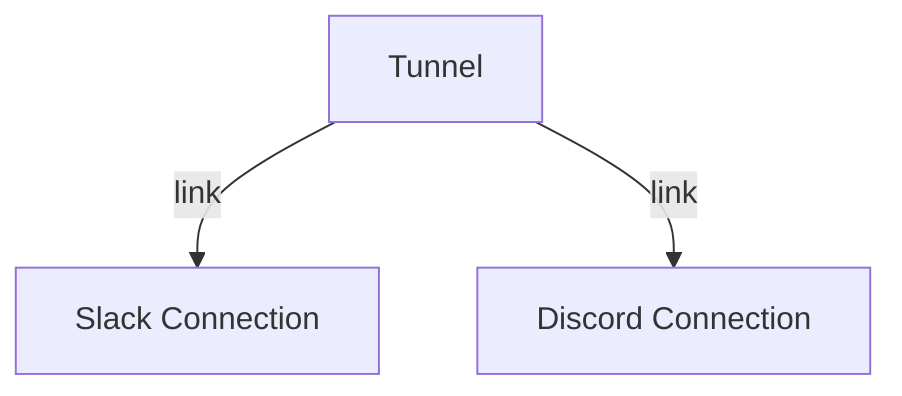

# `5-links-and-monitors`

When dealing with long-lived processes, it is useful to know when they
_terminate_ to either act upon it, or to have other processes terminate
together as a unit.

For these use-cases, Riot has _monitors_ and _links_. One key difference
between these two is that _links_ are bidirectional and transitive. _Monitors_
are not.

## Monitors

A *monitor* lets one process (`pid1`) be notified when another process (`pid2`)
terminates. Monitors are created with the function `monitor pid1 pid2`, like
this:

```ocaml
let pid1 = spawn loop in
let pid2 =
  spawn (fun () ->
    monitor (self ()) pid1;
    await_monitor_message ())
in
(* ... *)
```

In our example, our second process is looping using a function that awaits a
specific monitoring message called `Process_down`, which includes the Pid of
the process that died.

```ocaml
let rec await_monitor_message () =
  match receive () with
  | Process.Messages.Monitor (Process_down pid) ->
      Format.printf "uh-oh! Process %a terminated\n%!" Pid.pp pid
  | _ -> await_monitor_message ()
```

If you've followed the tutorial so far, this should look familiar. `await_monitor_message` is:
* a recursive function
* that suspends the process until a message is received
* and prints out a message when the monitored process goes down

To actively terminate our first process here, we can use `exit pid Normal`,
which tells the runtime to terminate this process with the reason `Normal`.
Exit reasons are a way to capture _why_ a process terminated, and include:

* `Normal` – used when a process' exit is expected, and is the default when a
  process function finishes
* `Exception exn` – used when a process ended because of an unhandled exception

## Links

A *link*, in contrast to a monitor, will actually link together the lifecycle
of 2 processes. This means that if `pid1` goes down, _so does `pid2`_.

This is incredibly useful to split up work into several processes while still
being able to deal with all of them as a single unit of work.

In our example, we create 2 more processes (`pid3` and `pid4`):

```ocaml
let pid3 = spawn loop in
let pid4 =
  spawn (fun () ->
    link pid3;
    loop ())
in
(* ... *)
```

Two differences to note here are:
1. both of processes are using a regular infinite-loop function, no need to match on a specific message
2. the `link pid` function always links the _current process_ with another process.

Since links are bidirectional, linking one end of 2 processes is enough.

Links are also _transitive_, which means that if we add a new process `pid5`
and link it to `pid4`, then exiting `pid3` will terminate `pid4` which will
terminate `pid5`.

Hopefully this gives you an idea of how links can be used to group processes
and establish dependencies between them.

### Realistic Example

For example, a "slack-to-discord" tunnel would need to read from slack, and
write to discord. Each of those tasks can be done in a separate process. But if
the slack connection goes down, it doesn't make sense to keep the discord
connection open. We can model our tunnel with links like this:



So that when the Slack Connection process terminates, it will also terminate
the Tunnel process, which will also terminate the Discord Connection.

In the next chapters we will learn about supervision, which will help us
_restart_ this tunnel and recreate our processes from a known-state, using
different strategies.

## Next Steps

* the [next step](../6-supervisors) introduces you to supervisors, a concept
  built on top of links to orchestrate processes using certain strategies.
