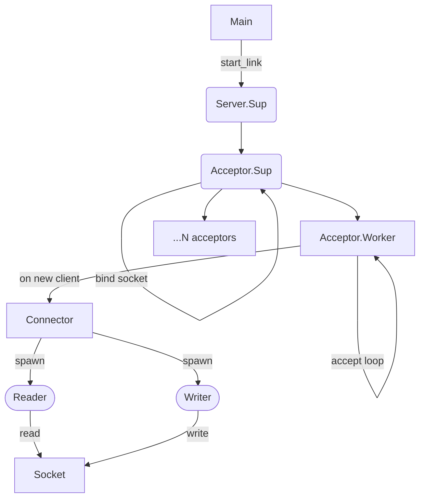

# `http_server`

This is a more complex example where we build an HTTP server from scratch,
starting with a wrapper around UNIX sockets that plays more nicely with Riot,
and then building a supervision hierarchy for accepting connections and passing
them on through a protocol handler.

Our simple server is then started from the `main.ml` file just like any other process-based server is, calling `start_link`.

```ocaml
let (Ok _server) = Http_server.start_link ~port @@ fun reqd -> ... in
```

## The Server Supervision Tree

For this example, I used the [ranch][ranch] Erlang library as a base. In Ranch,
the supervision tree is rather complex and relies on features that Riot
supervisors don't yet have (namely dynamic children).



It starts with the _Server supervisor_, which spins up 1 _Acceptor supervisor_.
The _Acceptor supervisor_ binds to the TCP socket and creates N _Acceptor
workers_. Every worker enters an _accept loop_ where they await for new
connections on the shared TCP socket.

Once a client connects and the socket's accept call is resolved, the acceptor
will spawn a new _Connector process_, link it, initiates the Connector's
handshake process, add its pid to the list of connections, and continue
awaiting for the next client by recursing over `accept_loop`.

This loop lets us immediately offload the work of handling a connection to a
new process (potentially in a separate scheduler thread), and instantly resume
listening for new connections.

The _Connector process_ receives the connection (a file descriptor) for this
specific server/client interaction, and will await the beginning of the
handshake process. This is used to indicate that the Acceptor is finished with
the setup, and the Connector can start its work. This coordination happens via
the `Connector.Handshake` message.

The Connector then spawns and links a writer and a reader process, which loop
over the socket and use a `Socket.Flow.t` to configure how to consume it. The
API of `Socket.Flow.t` is modeled very close to how `http/af` works, since that
was the only requirement this example had. 


