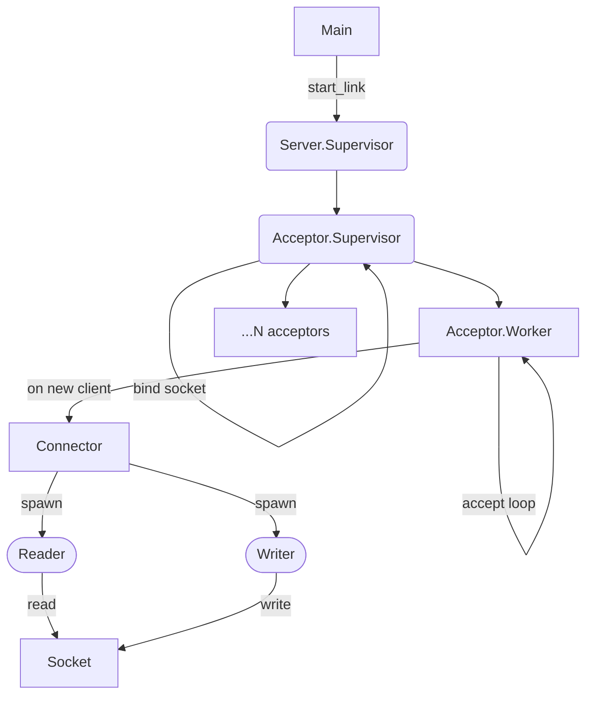

# `http_server`

This is a more complex example where we build an HTTP server from scratch,
starting with a wrapper around UNIX sockets that plays more nicely with Riot,
and then building a supervision hierarchy for accepting connections and passing
them on through a protocol handler.

Our simple server is then started from the `main.ml` file just like any other process-based server is, calling `start_link`.

```ocaml
let (Ok _server) = Http_server.start_link ~port @@ fun reqd -> ... in
```

The `Http_server` module configured the more interesteing `Server` module to use a `Tcp_connector` configured to handle requests using `http/af`. That bit of configuration is crucial, otherwise our server wouldn't know what protocol the client is trying to talk to, but it is irrelevant to how the application is designed.

In fact, the entire Server itself would work for any protocol as long as we can
implements a `Socket.Flow.t` value to read/write it.

## The Server Supervision Tree

For this web server, I modeled the supervision tree after the [ranch][ranch]
Erlang library. It looks roughly like this



It all starts with the _Server supervisor_, which spins up 1 _Acceptor supervisor_.
This pattern of supervisors supervising supervisors is very common for structuring applications in Erlang.

The _Acceptor supervisor_ binds to a fresh TCP socket and creates N _Acceptor
workers_. Every worker enters an _accept loop_ where they await for new
connections on the shared TCP socket.

Once a client connects, the acceptor will spawn a new _Connector process_, link
it, initiates the Connector's handshake process, add its pid to the list of
connections, and continue awaiting for the next client by recursing over
`accept_loop`.

This loop lets us immediately offload the work of handling a connection to a
new process (potentially in a separate scheduler thread), and instantly resume
listening for new connections.

The _Connector process_ receives the connection (a file descriptor) for this
specific server/client interaction, and will await the beginning of the
handshake process. This is used to indicate that the Acceptor is finished with
the setup, and the Connector can start its work. This coordination happens via
the `Connector.Handshake` message.

The Connector then spawns and links a writer and a reader process, which loop
over the socket and use a `Socket.Flow.t` to configure how to consume it. The
API of `Socket.Flow.t` is modeled very close to how `http/af` works, since that
was the only requirement this example had. 


[ranch]: https://github.com/ninenines/ranch

## Benchmarking

To load-test this little server we used [vegeta][vegeta] and the following command:

```
; echo "GET http://localhost:2112" | vegeta attack -duration=10s -workers=5 | tee result.bin | vegeta report
```

Here's a few runs of this on a Mac Studio (20-cores, 128GB RAM):

```
; echo "GET http://localhost:2112" | vegeta attack -duration=5s -workers=10 | tee result.bin | vegeta report
Requests      [total, rate, throughput]         250, 50.20, 50.20
Duration      [total, attack, wait]             4.98s, 4.98s, 268.375µs
Latencies     [min, mean, 50, 90, 95, 99, max]  222.125µs, 712.787µs, 427.729µs, 872.27µs, 2.335ms, 6.48ms, 7.741ms
Bytes In      [total, mean]                     500, 2.00
Bytes Out     [total, mean]                     0, 0.00
Success       [ratio]                           100.00%
Status Codes  [code:count]                      200:250
Error Set:

; echo "GET http://localhost:2112" | vegeta attack -duration=10s -workers=5 | tee result.bin | vegeta report
Requests      [total, rate, throughput]         500, 50.10, 14.38
Duration      [total, attack, wait]             34.501s, 9.981s, 24.521s
Latencies     [min, mean, 50, 90, 95, 99, max]  172.25µs, 240.897ms, 525.931µs, 1.252ms, 2.331ms, 16.944ms, 30.001s
Bytes In      [total, mean]                     992, 1.98
Bytes Out     [total, mean]                     0, 0.00
Success       [ratio]                           99.20%
Status Codes  [code:count]                      0:4  200:496
Error Set:

```
